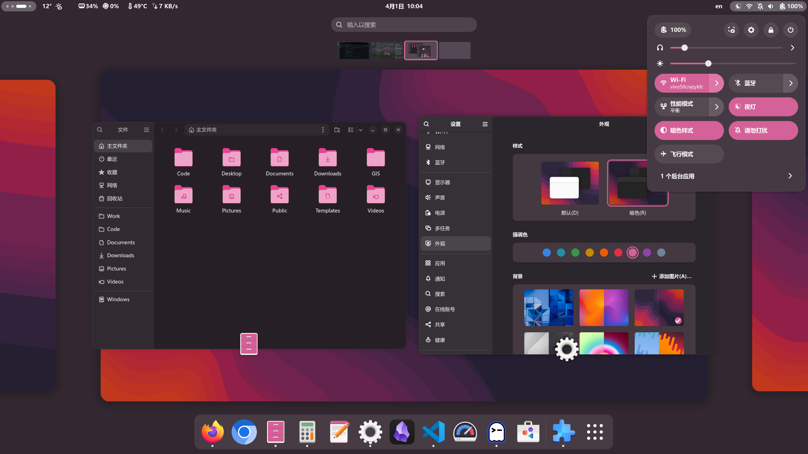

# Adwaita Tint Theme

A lightweight GNOME theme that allows you to tint the default Adwaita theme with your selected accent color. This theme modifies the appearance of GNOME Shell and GTK4 applications to create a cohesive and personalized desktop experience. In addition, it also tweaks some corner radius of gnome-shell such as top bar popup, quick settings, dash, app folders, and more.



## Features

- Customizable color tint for GNOME Shell and GTK4 applications.
- Maintains the clean look and feel of the default Adwaita theme.
- Tweaks corner radius of gnome-shell.

## Installation

To install the theme, run the following command from the project directory:

```bash
./install.sh
```

The installation script will:
- Copy the GNOME Shell theme to `~/.themes/adwaita-tint-theme/gnome-shell/`.
- Install the GTK4 CSS file to `~/.config/gtk-4.0/gtk.css`.
- Automatically backup your existing `gtk.css` file if it exists.

After installation, you can activate the theme using the [User Themes](https://extensions.gnome.org/extension/19/user-themes/) extension in GNOME Extensions.

## Uninstallation

To remove the theme, run:

```bash
./uninstall.sh
```

The uninstallation script will:
- Remove the GNOME Shell theme directory.
- Restore your previous `gtk.css` file from backup if it exists.
- Clean up the theme directories.

## Flatpak Applications

For Flatpak applications to use this theme, allow Flatpak to access your user theme directory:

```bash
flatpak override --user --filesystem=xdg-config/gtk-4.0:ro
```

## GNOME Extensions

- Apply Theme (Required): Install the [User Themes](https://extensions.gnome.org/extension/19/user-themes/) extension to apply this theme in GNOME Extensions.
- Icon Color Matching (Recommended): Install the [Adwaita Colors Home](https://github.com/dpejoh/Adwaita-Colors-Home) extension to match icon colors with the theme colors.

## Credits

- [pakovm-git](https://github.com/pakovm-git) for the original color theme.
- [Adwaita Colors Home](https://github.com/dpejoh/Adwaita-Colors-Home) for the icon color matching extension.
- [User Themes](https://extensions.gnome.org/extension/19/user-themes/) for the GNOME Shell theme extension.
